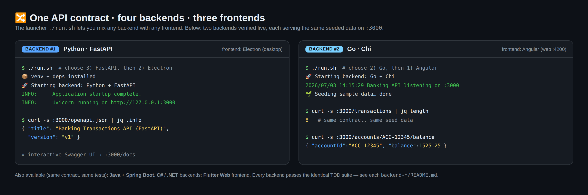
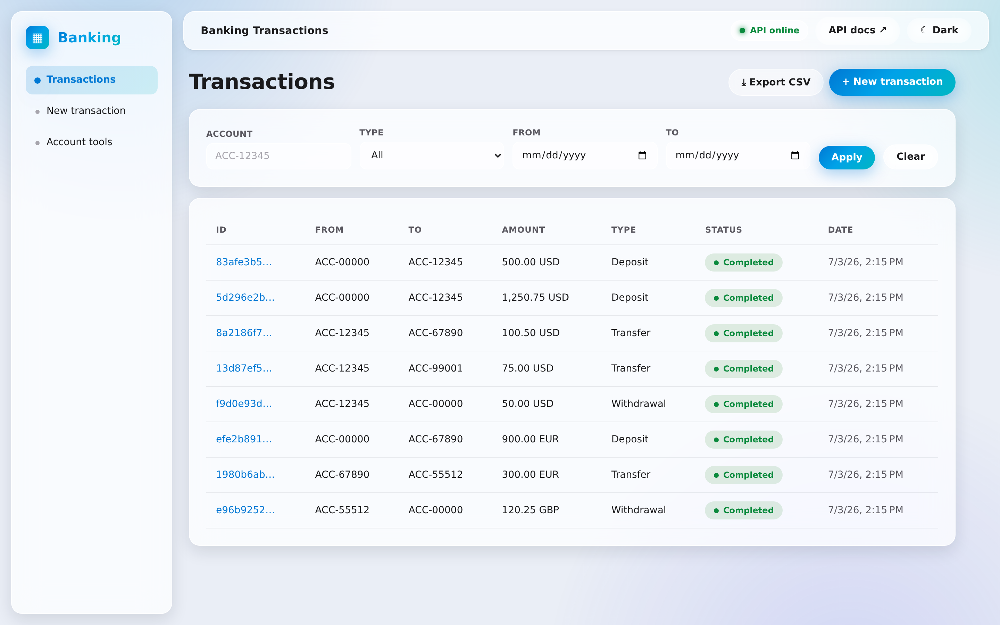
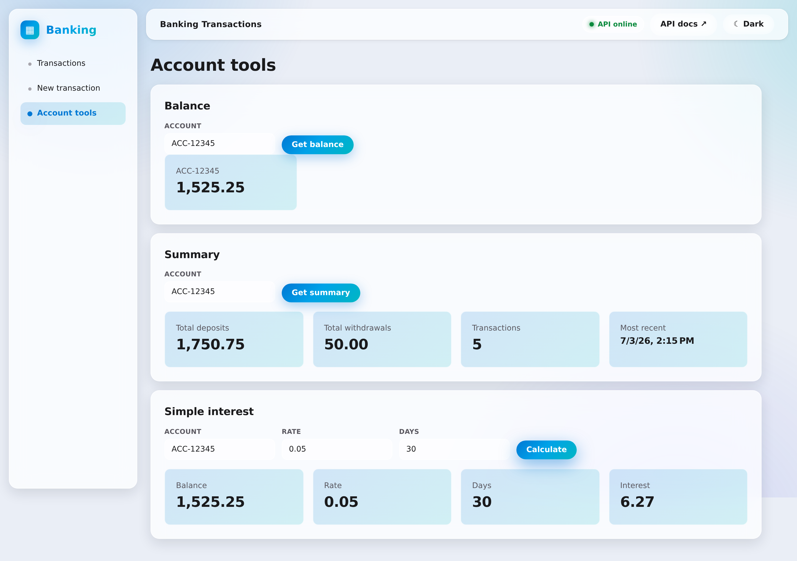
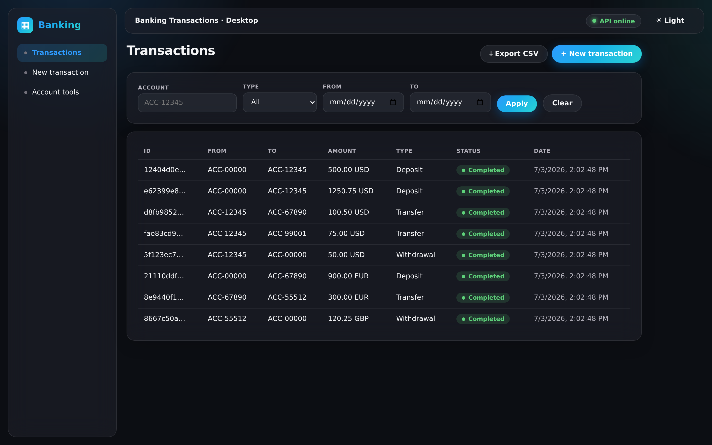
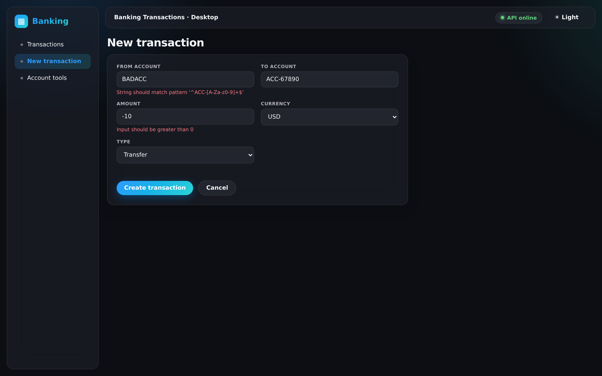
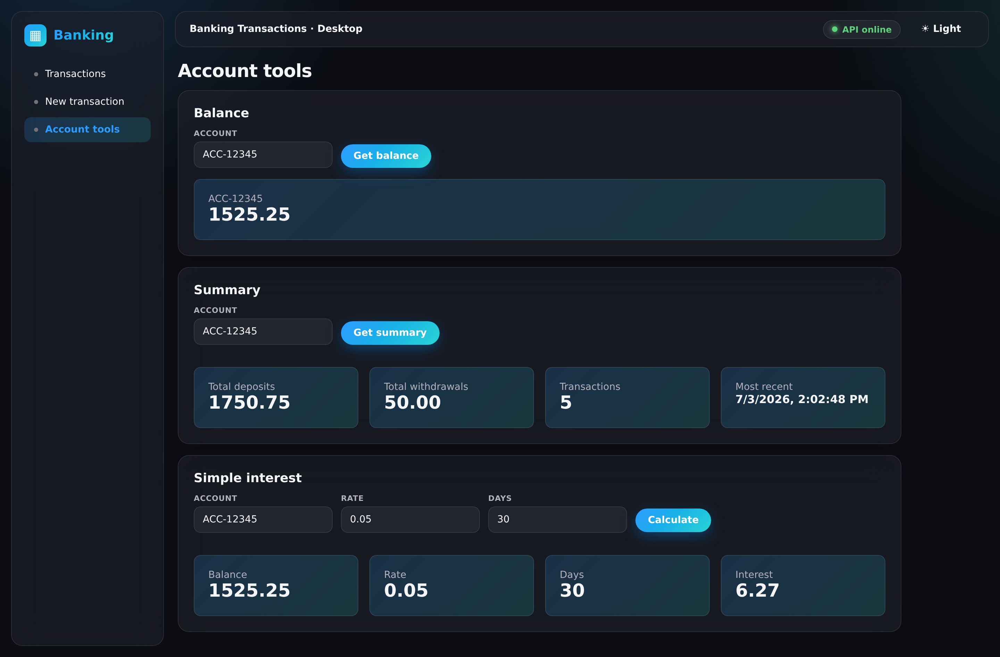
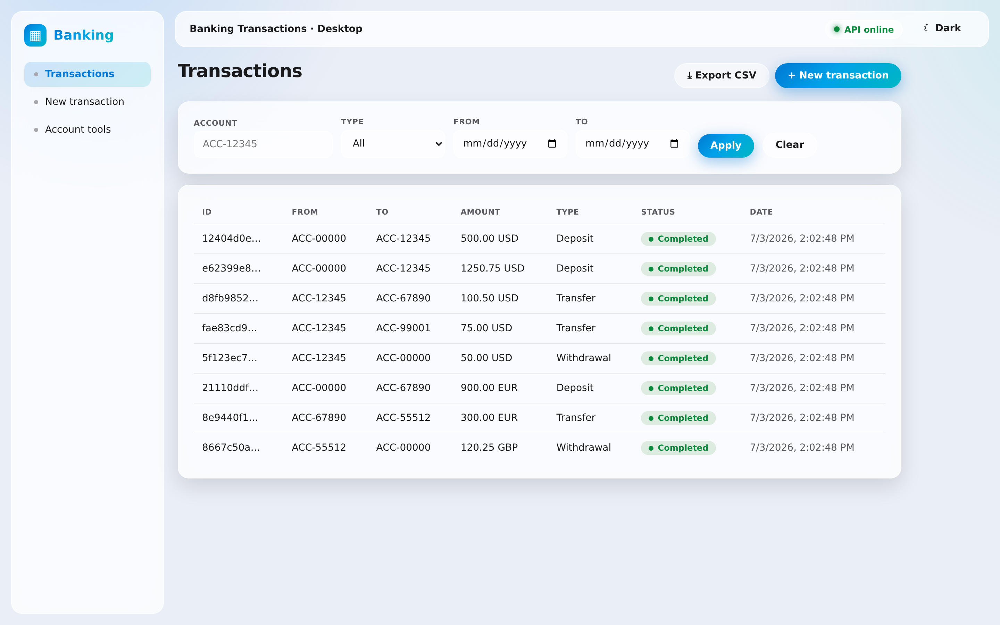
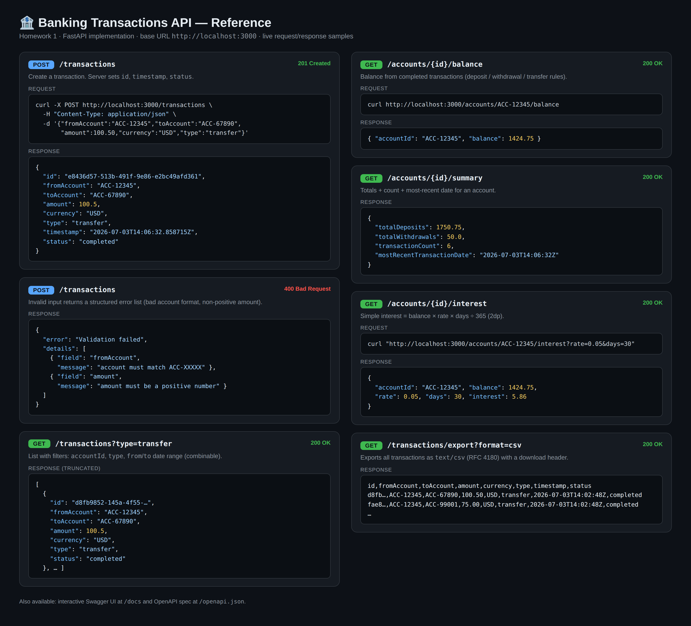

# 🏦 Banking Transactions — User Guide

A friendly, screenshot-driven walkthrough of the **Homework 1 Banking Transactions**
application: how to run it, what it can do, and how every feature looks in practice.

The project is a small but complete banking-transactions system built **test-first (TDD)**.
Its defining trait is that **one REST contract** is implemented by **four interchangeable
backends** and consumed by **three interchangeable frontends** — you can mix and match any
pair. This guide demonstrates two of each, live.

> PDF versions of this guide are available in **English** (`user-guide-en.pdf`) and
> **Ukrainian** (`user-guide-uk.pdf`) in this folder.

---

## 1. What's in the box

| Layer | Options | Location |
|-------|---------|----------|
| **Backends** (pick one, all on `:3000`, identical contract & tests) | Java + Spring Boot · Go + Chi · Python + FastAPI · C# / .NET | `backend/`, `backend-go/`, `backend-fastapi/`, `backend-dotnet/` |
| **Frontends** (pick one) | Angular + Microsoft Fluent (web `:4200`) · Electron (desktop) · Flutter Web | `frontend/`, `frontend-electron/`, `frontend-flutter/` |

**Features** (every backend implements all of them):

- Create / list / fetch transactions with structured validation errors
- Filter history by account, type, and date range (combinable)
- Account **balance**, **summary**, and **simple-interest** calculators
- **CSV export** (RFC 4180)
- Per-IP **rate limiting** (429 when exceeded)
- Interactive API docs + health endpoint

---

## 2. How to run it

### Quick start (recommended)

From the `homework-1/` folder, run the interactive launcher:

```bash
./run.sh
```

It asks you to choose a **backend** (Java / Go / FastAPI / .NET) and a **frontend**
(Angular / Electron / Flutter). It then:

1. starts the backend on **http://localhost:3000**,
2. waits until it's healthy and **seeds sample data** (`demo/seed.sh`),
3. launches the frontend,
4. stops everything cleanly on **Ctrl+C**.

You only need the toolchain for the stack you pick (e.g. `python3` for FastAPI,
`go` for Go, `npm` for Angular/Electron). Full manual steps per stack are in
[`../../HOWTORUN.md`](../../HOWTORUN.md) and each `backend-*/README.md`.

### Run one stack manually — examples

```bash
# Python + FastAPI backend
cd backend-fastapi
python3 -m venv .venv && ./.venv/bin/pip install -r requirements.txt
./.venv/bin/uvicorn app.main:app --port 3000

# Go + Chi backend
cd backend-go && go run ./cmd/server        # listens on :3000

# Angular frontend (proxies /api → :3000)
cd frontend && npm install && npm start      # http://localhost:4200

# Electron desktop frontend
cd frontend-electron && npm install && npm start
```

The **API-online** chip in the top-right of any frontend confirms it reached the backend.

---

## 3. Mix & match: two frontends × two backends (verified live)

The screenshots in this guide were captured against **two different stacks**, proving the
shared contract works regardless of the combination:

| Combination | Frontend | Backend | Screenshots |
|-------------|----------|---------|-------------|
| **Stack A** | Electron (desktop) | Python · FastAPI | §5–§9 |
| **Stack B** | Angular · Fluent (web) | Go · Chi | §4 |

Both backends booted on `:3000`, seeded the same 8 sample transactions, and answered the
same requests:



---

## 4. Stack B — Angular (Fluent UI) on the Go backend

The Angular web app talking to the **Go** backend. Same data, same features, a different
frontend and a different backend from the rest of this guide:

**Transactions list**



**Account tools** — balance, summary, and simple interest, all computed by Go:



---

## 5. Browsing transactions

*(Screenshots below: Electron desktop app on the FastAPI backend.)*

The **Transactions** view lists every transaction with its short ID, accounts, amount +
currency, type, a colour-coded **status** badge, and date.



**Filtering the history** — use the filter bar above the table:

| Filter | What it does |
|--------|--------------|
| **Account** | Transactions where the account is sender **or** receiver (`ACC-12345`). |
| **Type** | `Deposit`, `Withdrawal`, or `Transfer`. |
| **From / To** | Inclusive date range. |

Filters combine (logical **AND**). Click **Apply** to run them, **Clear** to reset.
The **⤓ Export CSV** button downloads the current list as a `.csv` file.

---

## 6. Creating a transaction

Click **+ New transaction**, fill in the fields, and press **Create transaction**.
The form validates input and shows a message **under each field** when something is wrong —
here, an account that doesn't match `ACC-XXXXX` and a non-positive amount:



**Field rules**

- **From / To account** — must match `ACC-XXXXX` (e.g. `ACC-12345`).
- **Amount** — positive number, max 2 decimal places.
- **Currency** — valid ISO 4217 code (USD, EUR, GBP, JPY).
- **Type** — deposit, withdrawal, or transfer.

On success you get a toast confirmation and return to the list with the new record on top.

---

## 7. Account tools

Enter an account number and click the button in each card:



- **Balance** — computed from completed transactions.
- **Summary** — total deposits, total withdrawals, transaction count, most-recent date.
- **Simple interest** — enter **rate** (e.g. `0.05`) and **days** (e.g. `30`);
  result = `balance × rate × days ÷ 365`, rounded to 2 decimals.

---

## 8. Light & dark themes

Use the **☀ Light / ☾ Dark** toggle in the top-right. Tables, badges, and cards all adapt:



---

## 9. The REST API

The UI is a thin client over a REST API you can call directly with `curl`, Postman, or the
VS Code REST Client. Real request/response samples:



| Method | Endpoint | Purpose |
|--------|----------|---------|
| `POST` | `/transactions` | Create (201; 400 with a structured error list on invalid input). |
| `GET`  | `/transactions` | List, with `accountId` / `type` / `from` / `to` filters. |
| `GET`  | `/transactions/{id}` | Fetch one (404 if missing). |
| `GET`  | `/transactions/export?format=csv` | Download all transactions as CSV. |
| `GET`  | `/accounts/{id}/balance` | Account balance. |
| `GET`  | `/accounts/{id}/summary` | Deposits / withdrawals / count / most-recent date. |
| `GET`  | `/accounts/{id}/interest?rate=&days=` | Simple interest. |

Interactive **Swagger UI**: `http://localhost:3000/docs` · OpenAPI spec: `http://localhost:3000/openapi.json`.

```bash
curl -X POST http://localhost:3000/transactions \
  -H "Content-Type: application/json" \
  -d '{"fromAccount":"ACC-12345","toAccount":"ACC-67890","amount":100.50,"currency":"USD","type":"transfer"}'

curl http://localhost:3000/transactions
curl http://localhost:3000/accounts/ACC-12345/balance
```

---

## Screenshot index

| File | Shows |
|------|-------|
| `img/01-transactions.png` | Transactions list, filters, status badges (Electron · FastAPI, dark) |
| `img/02-new-transaction.png` | New-transaction form with per-field validation errors |
| `img/03-account-tools.png` | Balance, summary, and simple-interest results |
| `img/04-api-reference.png` | REST API endpoints with live request/response samples |
| `img/05-transactions-light.png` | Transactions list in light theme |
| `img/06-angular-transactions.png` | Angular Fluent UI transactions list (Go backend) |
| `img/07-angular-account-tools.png` | Angular account tools (Go backend) |
| `img/08-two-backends.png` | Two backends (FastAPI + Go) verified live on `:3000` |
