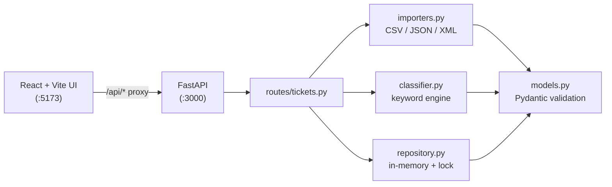

# 🏦 Homework 1: Banking Transactions API

> **Student Name**: Elena Chiperi
> **Date Submitted**: 06.07.2026
> **AI Tools Used**: Claude Code (Opus 4.8)
> A support-ticket management system: multi-format import, automatic
> classification, a full test suite, and a React front-end.

---

## 📋 Overview

A REST API and web UI for customer-support agents. Tickets can be created one at
a time or bulk-imported from **CSV / JSON / XML**. Every ticket can be
**auto-classified** (category + priority) by a deterministic keyword engine that
also returns a confidence score, reasoning, and the matched keywords. The React
front-end lets agents list, filter, create, edit, inspect, import, and classify
tickets.

**Stack:** Python + FastAPI (backend) · React + Vite + TypeScript (frontend) ·
pytest + coverage (tests).

## ✨ Features

- CRUD REST API for tickets with field validation and structured errors
- Bulk import from CSV, JSON, and XML with a per-row success/failure summary
- Deterministic auto-classification (category, priority, confidence, reasoning)
- Filtering by category, priority, and status (combinable)
- **96%+ test coverage** across 58 tests (unit, integration, performance)
- Responsive React UI that consumes the live API (no hardcoded data)
- Auto-generated OpenAPI docs at `/docs`

## 🏗️ Architecture



## 🚀 Quick start

One command from `homework-2/` (creates the venv, installs deps, starts backend
+ frontend, seeds sample data, stops on Ctrl+C):

```bash
./run.sh
```

Or run each part manually:

```bash
# 1) Backend  (http://localhost:3000)
cd backend
python3.13 -m venv .venv
./.venv/bin/pip install -r requirements.txt
./.venv/bin/uvicorn app.main:app --port 3000

# 2) Frontend (http://localhost:5173) — in a second terminal
cd frontend
npm install
npm run dev
```

Open **http://localhost:5173**. See [HOWTORUN.md](HOWTORUN.md) for full details,
health/docs URLs, and seeding sample data.

> **Note on Python:** the project targets **Python 3.13** (pinned deps ship
> prebuilt wheels for it). Python 3.14 forces a from-source build of
> `pydantic-core`; use 3.13 to avoid that.

## 🧪 Running the tests

```bash
cd backend
./.venv/bin/pytest
```

This runs all 58 tests and enforces `--cov-fail-under=85`; an HTML report is
written to `backend/htmlcov/`. See [docs/TESTING_GUIDE.md](docs/TESTING_GUIDE.md).

## 📚 Documentation

| Doc | Audience |
|-----|----------|
| [README.md](README.md) | Developers — overview & setup |
| [docs/API_REFERENCE.md](docs/API_REFERENCE.md) | API consumers — endpoints & cURL |
| [docs/ARCHITECTURE.md](docs/ARCHITECTURE.md) | Tech leads — design & data flow |
| [docs/TESTING_GUIDE.md](docs/TESTING_GUIDE.md) | QA — test strategy & benchmarks |
| [PROMPT.md](PROMPT.md) | Context-Model-Prompt artifacts |

## 📁 Project structure

```
homework-2/
├── backend/                 # FastAPI app + pytest suite
│   ├── app/                 # models, repository, routes, importers, classifier, errors
│   ├── tests/               # 8 test files + fixtures
│   ├── requirements.txt
│   └── pyproject.toml       # pytest + coverage config
├── frontend/                # React + Vite + TypeScript SPA
│   └── src/                 # api client, components, App
├── docs/                    # API_REFERENCE, ARCHITECTURE, TESTING_GUIDE, screenshots
├── demo/                    # sample-data generator + seed script
├── sample_tickets.{csv,json,xml}       # 50 / 20 / 30 tickets
├── invalid_tickets.{csv,json,xml}      # negative-test data
├── HOWTORUN.md
└── PROMPT.md
```

## 📦 Sample data

`sample_tickets.csv` (50), `sample_tickets.json` (20), `sample_tickets.xml` (30),
plus `invalid_tickets.*` for negative tests. Regenerate with:

```bash
python3 demo/generate_sample_data.py
```

---

<div align="center">

*Completed as part of the AI-Assisted Development course.*

</div>
