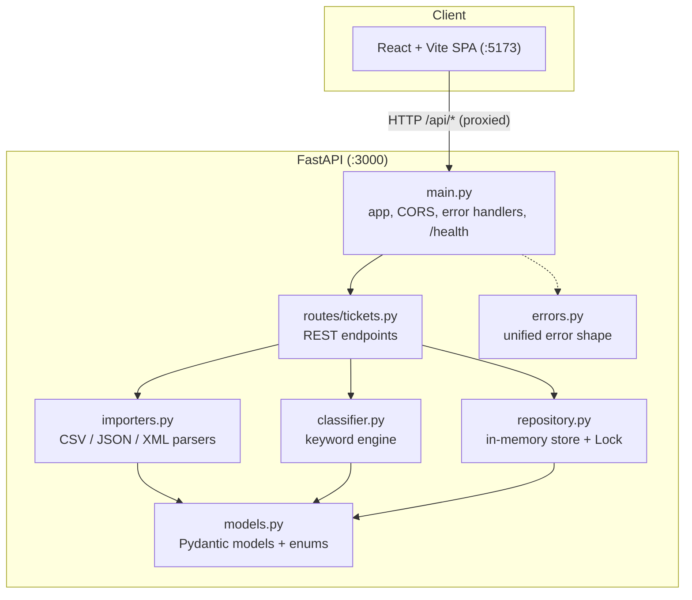
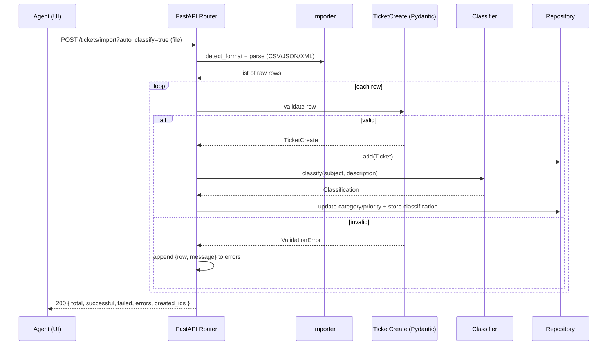

# Architecture

_Generated with the assistance of Claude Opus 4.8._

## High-level architecture

## Components

| Component | Responsibility |
|-----------|----------------|
| `models.py` | Pydantic v2 models + enums; input validation (`TicketCreate`), entity (`Ticket`), partial update (`TicketUpdate`), `Classification`. |
| `repository.py` | Thread-safe in-memory `dict` store; filtering; sets `resolved_at` on resolve. |
| `routes/tickets.py` | All REST endpoints + `_classify_and_store` helper reused by create/import/classify. |
| `importers.py` | Parses each format to normalized rows, validates row-by-row, collects errors. |
| `classifier.py` | Deterministic keyword matching → category, priority, confidence, reasoning, keywords. |
| `errors.py` | Custom exceptions + handlers producing `{error, details}` uniformly. |
| `main.py` | Wires app, CORS, error handlers, router, and `/health`. |

## Data flow — bulk import with auto-classification

## Design decisions & trade-offs

- **In-memory repository.** Keeps the assignment focused and tests fast/isolated.
  Trade-off: no persistence across restarts. The repository is a single class, so
  swapping in a database is localized.
- **Deterministic keyword classifier (not an LLM).** Fully testable, instant, no
  API keys or cost, and it directly satisfies the "keywords found + reasoning"
  requirement. Trade-off: less nuanced than an LLM; keyword tables must be
  curated. The interface (`classify_text`) makes an LLM swap-in straightforward.
- **stdlib-only parsers** (`csv`, `json`, `xml.etree`). No extra dependencies;
  row-level errors are collected so one bad row never aborts a whole import.
- **Unified error shape** across validation, not-found, and malformed-file cases,
  so the frontend has one code path for surfacing failures.
- **Vite dev proxy** (`/api` → `:3000`) avoids CORS config in development and
  keeps the API host out of the frontend source.

## Security considerations

- All input is validated by Pydantic (email format, string lengths, enum
  membership) before it reaches the store.
- Uploaded files are parsed defensively; parser exceptions become 400s, never
  stack traces.
- CORS is currently open (`*`) for local development — lock this down to the
  known frontend origin before any real deployment.
- No authentication layer yet; add one (e.g. token middleware) before exposing
  the API beyond localhost.

## Performance considerations

- Reads and writes are O(1)/O(n) over an in-memory dict; the `Lock` serializes
  writes, which the concurrent-request test (25 simultaneous creates) exercises.
- Classification is pure string matching — ~1000 classifications well under 2s
  (see [TESTING_GUIDE.md](TESTING_GUIDE.md) benchmarks).
- Import of 50 rows parses+validates in well under a second.
