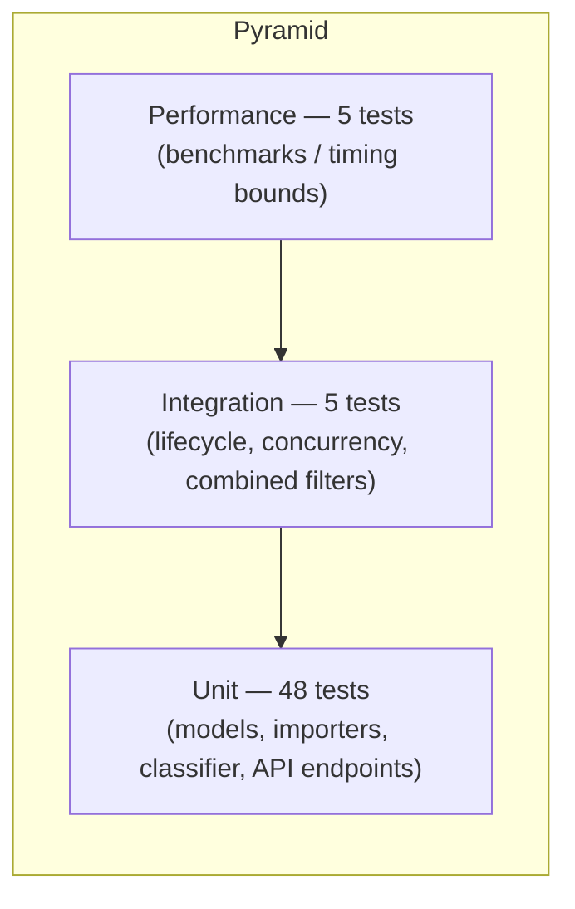

# Testing Guide

_Generated with the assistance of Claude Haiku 4.5._

## Test pyramid



The suite is unit-heavy: fast, isolated model/parser/classifier tests form the
base, a handful of integration tests verify end-to-end workflows, and a thin
layer of performance tests guards throughput.

## Test files

| File | Focus | Tests |
|------|-------|-------|
| `test_ticket_api.py` | API endpoints (CRUD, filters, 404s) | 12 |
| `test_ticket_model.py` | Pydantic validation | 9 |
| `test_import_csv.py` | CSV parsing + import | 6 |
| `test_import_json.py` | JSON parsing + import | 5 |
| `test_import_xml.py` | XML parsing + import | 5 |
| `test_categorization.py` | Classifier + endpoint | 11 |
| `test_integration.py` | End-to-end workflows (Task 6) | 5 |
| `test_performance.py` | Benchmarks (Task 6) | 5 |
| **Total** | | **58** |

## How to run

```bash
cd backend
python3.13 -m venv .venv
./.venv/bin/pip install -r requirements.txt

# Full suite + coverage gate (fails under 85%)
./.venv/bin/pytest

# A single file
./.venv/bin/pytest tests/test_categorization.py -v

# Open the HTML coverage report
open htmlcov/index.html
```

Coverage config lives in `backend/pyproject.toml`
(`--cov=app --cov-report=term-missing --cov-report=html --cov-fail-under=85`).

## Latest coverage

```
Name                     Stmts   Miss  Cover
------------------------------------------------
app/classifier.py           45      0   100%
app/errors.py               25      0   100%
app/importers.py           102     10    90%
app/main.py                 14      0   100%
app/models.py               90      0   100%
app/repository.py           54      3    94%
app/routes/tickets.py       49      0   100%
------------------------------------------------
TOTAL                      379     13    97%   (58 passed)
```

Screenshot: [screenshots/test_coverage.png](screenshots/test_coverage.png).

## Sample test data

| Location | Purpose |
|----------|---------|
| `backend/tests/fixtures/valid_tickets.{csv,json,xml}` | Happy-path import |
| `backend/tests/fixtures/invalid_tickets.{csv,json,xml}` | Row-level validation errors |
| `backend/tests/fixtures/malformed.{json,xml}` | Whole-file parse failure → 400 |
| `sample_tickets.{csv,json,xml}` (repo root) | 50 / 20 / 30 realistic tickets |
| `invalid_tickets.{csv,json,xml}` (repo root) | Deliverable negative-test data |

## Manual testing checklist

- [ ] `POST /tickets` with valid body → 201, server-set `id`/timestamps
- [ ] `POST /tickets` with bad email → 400 with `details`
- [ ] `POST /tickets/import` with `sample_tickets.csv` → 50 successful
- [ ] `POST /tickets/import` with `invalid_tickets.csv` → partial success + errors
- [ ] `POST /tickets/import` with `malformed.json` → 400
- [ ] `GET /tickets?category=…&priority=…` → filtered list
- [ ] `POST /tickets/{id}/auto-classify` → category/priority/confidence/keywords
- [ ] `PUT /tickets/{id}` status → `resolved` sets `resolved_at`
- [ ] `DELETE /tickets/{id}` → 204, then `GET` → 404
- [ ] Frontend: create/edit validation, import summary, classify result, toasts
- [ ] Frontend: responsive layout at mobile width

## Performance benchmarks

Timing bounds asserted by `test_performance.py` (generous for CI stability;
typical local runs are far faster):

| Benchmark | Bound | Typical |
|-----------|-------|---------|
| Parse + validate 50 CSV rows | < 1.0 s | ~10 ms |
| Single classification | < 50 ms | < 1 ms |
| 1000 classifications | < 2.0 s | ~0.1 s |
| Create 100 tickets via API | < 2.0 s | ~0.3 s |
| Filtered list over 100 tickets | < 0.5 s | ~5 ms |
