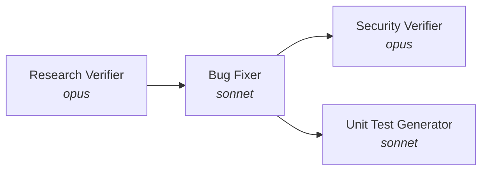

# 🤖 Homework 4: Four-Agent Pipeline

> **Student Name**: Elena Chiperi
> **Date Submitted**: 04.08.2026
> **AI Tools Used**: Claude Code (Opus 5, Sonnet 5)

---

## 📋 Overview

A four-agent pipeline that verifies a bug research report, applies the resulting
fix plan, security-reviews the changed code, and generates unit tests for it —
all from **one command**:

```bash
npm run pipeline
```

The pipeline operates on a deliberately broken sample application (`src/`): a
minimal Node.js cart service seeded with **two logic bugs** and **one security
vulnerability**.



Agents never talk to each other. Each one **reads files and writes files** — the
artifacts in `context/bugs/001/` are the interface between stages.

---

## 🎯 Results of the recorded run

| Stage | Gate | Outcome |
|---|---|---|
| 1. Research Verifier | `CONDITIONAL` | quality **C · UNRELIABLE** — 30/35 claims verified (86%), **4 of 4 seeded discrepancies found, 0 false positives** |
| 2. Bug Fixer | `PASS` | 3/3 changes applied · tests **5 pass / 7 fail → 12 pass / 0 fail** |
| 3. Security Verifier | `PASS` | **VULN-001 FIXED** · 0 CRITICAL, 0 HIGH, 3 MEDIUM, 2 LOW, 3 INFO |
| 4. Unit Test Generator | `PASS` | **+10 tests** · 22/22 pass · 0 FIRST violations · slowest 0.6 ms |

**Behaviour before and after:**

| Request | Before | After |
|---|---|---|
| `GET /coupon?code=SAVE10` | `{"code":"SAVE10","percent":10}` | unchanged ✅ |
| `GET /coupon?code=../credentials` | ☠️ `{"aws_secret":"AKIA-LEAKED-9999",…}` | `{"error":"invalid coupon code"}` |
| `POST /checkout` (2×$10 + 3×$5) | `{"total":15}` | `{"total":35}` |
| same, with coupon `SAVE10` | `{"total":5}` | `{"total":31.5}` |

---

## 🧠 Model selection per agent

Each agent declares its model in its own `*.agent.md` frontmatter, and
`run-pipeline.sh` reads it from there — the frontmatter *is* the configuration,
not a description of it.

| Agent | Model | Why this tier |
|---|---|---|
| **research-verifier** | `opus` | The task is **negative search** — noticing that a claimed behaviour is *absent* from the code, which cannot be done by matching. It also needs resistance to plausibility: a weaker model tends to agree with text that sounds competent. Nothing checks this agent automatically, so the reasoning has to be right the first time. |
| **bug-fixer** | `sonnet` | All judgement was already spent upstream: the plan contains exact before/after fragments, coordinates and acceptance criteria. What remains is precise application. A stronger model would add risk rather than quality — the more reasoning capacity, the stronger the pull to "improve" things nobody asked for. Its mistakes are cheap because `npm test` catches them immediately. |
| **security-verifier** | `opus` | Vulnerability review is reasoning *as an attacker*, not checklist matching. The valuable part is judging a fix critically — allow-list vs blocklist, encoding bypasses, defence in depth. The cost of a missed vulnerability is asymmetric to the cost of the model. |
| **unit-test-generator** | `sonnet` | Mostly constructive: expected behaviour is already pinned down by the plan, the framework and style are fixed by the skill, and the remaining work is systematic enumeration of boundaries. Crucially, the output is **immediately checked by running it** — deterministic feedback lowers the required model strength. |

**The rule behind the table:** spend model capability where **no deterministic
oracle exists**. Verifiers are graded by nobody, so they get `opus`. The fixer and
the test generator are graded by `npm test`, so they get `sonnet`.

---

## 🔒 Tool permissions are constraints, not descriptions

`tools:` in each agent's frontmatter is an enforcement mechanism. Asking a model
politely not to edit code is a wish; removing `Edit` from its toolset is a fact.

| Agent | `tools` | What became impossible |
|---|---|---|
| research-verifier | `Read, Grep, Glob, Write` | no `Edit` → cannot "fix" the research it is auditing |
| bug-fixer | `Read, Edit, Write, Bash, Grep, Glob` | the only agent allowed to touch `src/` |
| security-verifier | `Read, Grep, Glob, Write` | no `Edit`/`Bash` → a reviewer that can patch stops being a reviewer |
| unit-test-generator | `Read, Write, Bash, Grep, Glob` | **`Write` but no `Edit`** → can create new test files, cannot rewrite existing ones |

The last row is the sharpest: it makes the worst failure mode of test
generation — **bending the oracle to fit the code** — mechanically impossible.

---

## 🚦 Gates: how an agent's verdict becomes control flow

Every agent emits a machine-readable block alongside its prose:

```
<!-- MACHINE-READABLE VERDICT -->
RESEARCH_QUALITY: C
DISCREPANCIES_CRITICAL: 2
GATE: CONDITIONAL
<!-- END VERDICT -->
```

`run-pipeline.sh` reads it with `grep` and branches on it:

```bash
case "$GATE" in
  HALT)        die "Research rejected — no code will be changed." ;;
  CONDITIONAL) grep -q "Claims excluded after verification" "$PLAN" \
                 || die "Plan does not neutralise CRITICAL findings. Stopping." ;;
  PASS)        ok "Research usable." ;;
esac
```

The same facts are stated twice — prose for humans, block for the orchestrator.
That redundancy is deliberate: **an agent whose output changes nothing is
decoration**. Gates turn its conclusion into a precondition.

---

## 🧪 Seeded defects and seeded lies

Two separate sets of defects were planted, and they test different things.

**In the application** (`src/`) — what the pipeline must fix:

| ID | File | Defect |
|---|---|---|
| BUG-001 | `src/cart.js:8` | `calculateTotal` ignores `item.quantity` |
| BUG-002 | `src/cart.js:14` | `applyDiscount` subtracts `percent` as dollars; no range validation |
| VULN-001 | `src/coupons.js:8` | path traversal (CWE-22) — unvalidated `code` joined into a file path |

Each bug **passes some tests** on purpose (baseline: 5 pass / 7 fail). A totally
red suite would let an agent score by rewriting the file wholesale; a partial
failure forces it to localise the defect.

**In the research** (`context/bugs/001/research/codebase-research.md`) — what the
verifier must catch. 13 claims, 4 of them deliberately false, each reproducing a
real way a model hallucinates about code:

| Type | Claim | Reality | Found |
|---|---|---|---|
| shifted line | `src/cart.js:9` | `:8` | ✅ `MINOR` |
| distorted quote | `total = total + item.price;` | `total += item.price;` | ✅ `MAJOR` |
| plausible fabrication | "rounds via `Math.round`" | no rounding exists at all | ✅ `CRITICAL` |
| nonexistent file | `src/validators.js:12` | file does not exist | ✅ `CRITICAL` |

**Answer key**: [`docs/expected-discrepancies.md`](docs/expected-discrepancies.md) —
deliberately kept **outside** `context/`, so no agent can read it.

A detector tested only on clean data is not tested at all. Without seeded lies,
`verified-research.md` would say "all good", and that output would be
indistinguishable from an agent that never opened a file.

---

## 📈 What the verification actually prevented

The two `CRITICAL` findings never reached the code:

- `applyDiscount` contains **no** `Math.round` — the invented rounding requirement
  was excluded from the plan and not implemented.
- `coupons.js` contains **no** import of `validators.js` — validation was written
  locally, as the plan directed.

The causal chain, end to end:

```
research lies  →  verifier catches it (CRITICAL)  →  rubric assigns level C
               →  plan lists it under exclusions  →  fixer does not implement it
```

Remove any link and `cart.js` would today contain rounding nobody asked for, and
`coupons.js` would import a module that does not exist.

One more result worth noting: **SEC-008** — the Security Verifier found a mismatch
between the *previous agent's* `fix-summary.md` and the actual code. Verification
travelled back up the pipeline.

---

## 📁 Project structure

```
homework-4/
├── README.md                     # this file
├── HOWTORUN.md                   # step-by-step run guide
├── package.json                  # npm test · npm start · npm run pipeline
│
├── agents/                       # 4 agents — model + tools in frontmatter
│   ├── research-verifier.agent.md      [opus]
│   ├── bug-fixer.agent.md              [sonnet]
│   ├── security-verifier.agent.md      [opus]
│   └── unit-test-generator.agent.md    [sonnet]
│
├── skills/
│   ├── research-quality-measurement.md # Task 1.2 — levels A–D + gate rule
│   └── unit-tests-FIRST.md             # Task 4.2 — FIRST as operational rules
│
├── scripts/run-pipeline.sh       # the single command
│
├── src/                          # sample application (Task 5)
│   ├── cart.js                   # BUG-001, BUG-002
│   ├── coupons.js                # VULN-001
│   └── server.js                 # HTTP entry point
├── data/SAVE10.json              # legitimate coupon
├── credentials.json              # decoy with fake secrets, outside data/
├── tests/
│   ├── cart.test.js              # baseline (hand-written)
│   ├── coupons.test.js           # baseline (hand-written)
│   ├── cart.generated.test.js        # ← agent-generated
│   └── coupons.generated.test.js     # ← agent-generated
│
├── context/bugs/001/             # pipeline artifacts
│   ├── bug-context.md                    # input  — defect case file
│   ├── research/codebase-research.md     # input  — with 4 seeded errors
│   ├── implementation-plan.md            # input  — post-verification plan
│   ├── research/verified-research.md     # OUTPUT — agent 1
│   ├── fix-summary.md                    # OUTPUT — agent 2
│   ├── security-report.md                # OUTPUT — agent 3
│   └── test-report.md                    # OUTPUT — agent 4
│
└── docs/
    ├── expected-discrepancies.md # answer key (not pipeline input)
    ├── runs/                     # per-stage execution logs
    └── screenshots/
```

---

## ⚠️ Notes on the assignment text

Two things in `TASKS.md` were resolved by judgement; both are documented rather
than silently patched:

1. **The run order (line 22) names six agents; only four are required tasks.**
   `codebase-research.md` and `implementation-plan.md` are therefore **seeded
   inputs**, authored by hand to represent the Bug Researcher and Bug Planner
   stages. This is what makes the seeded-lie experiment possible in the first
   place — a hand-authored research file can contain known, measurable errors.
2. **The structure diagram (line 109) says `homework-5/`.** This is a copy-paste
   error in the assignment; the work lives in `homework-4/`.

---

## 📚 Related documents

- **[HOWTORUN.md](HOWTORUN.md)** — how to run the app, the tests and the pipeline
- **[docs/expected-discrepancies.md](docs/expected-discrepancies.md)** — answer key and how to grade the verifier
- **[skills/research-quality-measurement.md](skills/research-quality-measurement.md)** — quality levels and gate rule
- **[skills/unit-tests-FIRST.md](skills/unit-tests-FIRST.md)** — FIRST as enforceable rules
