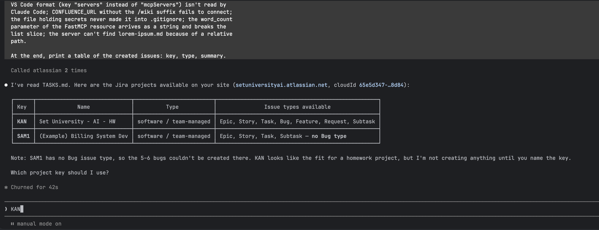
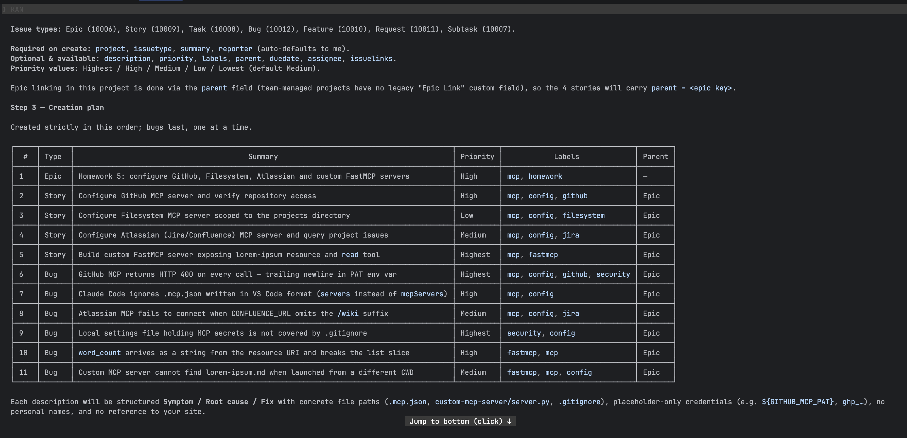
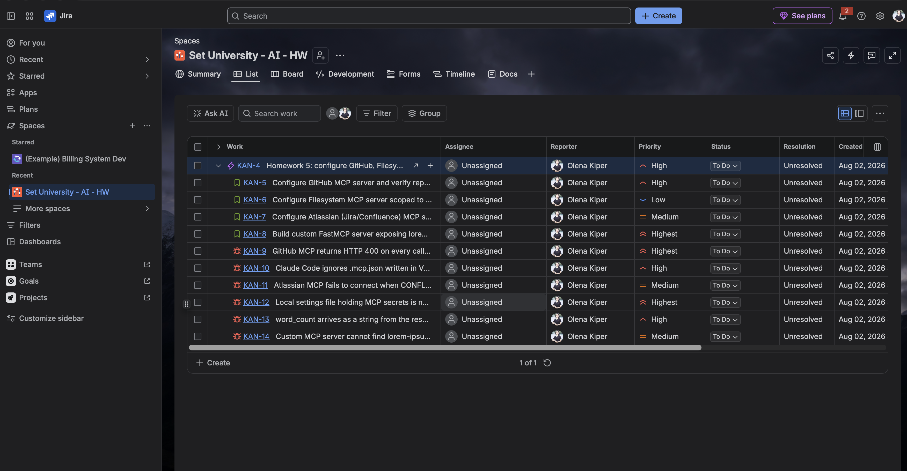
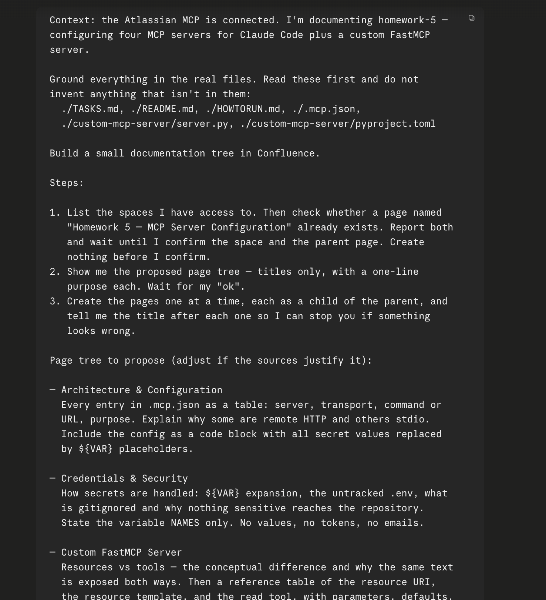
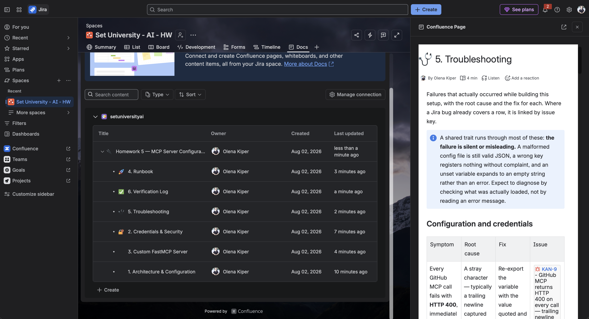
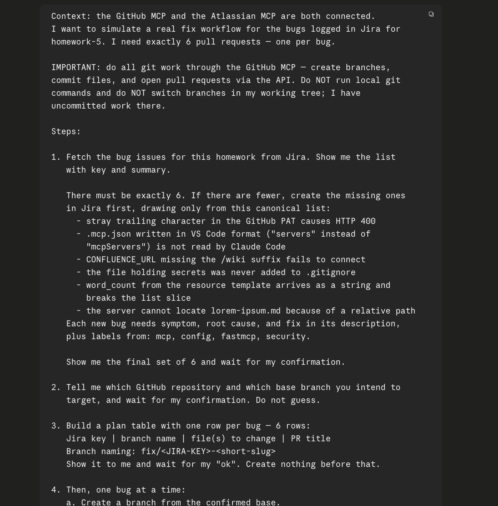
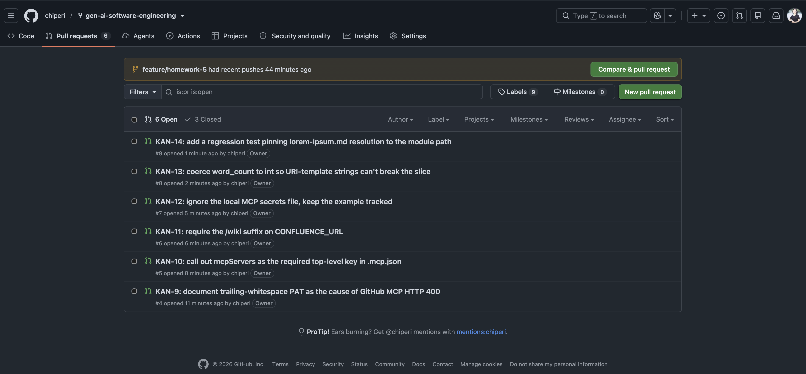
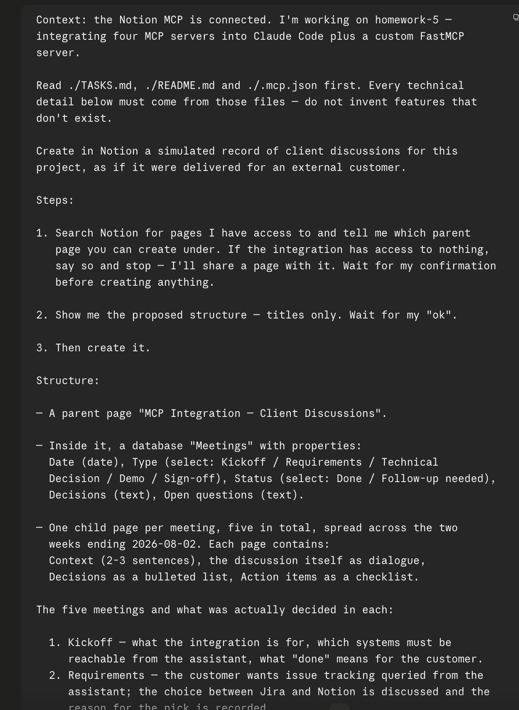
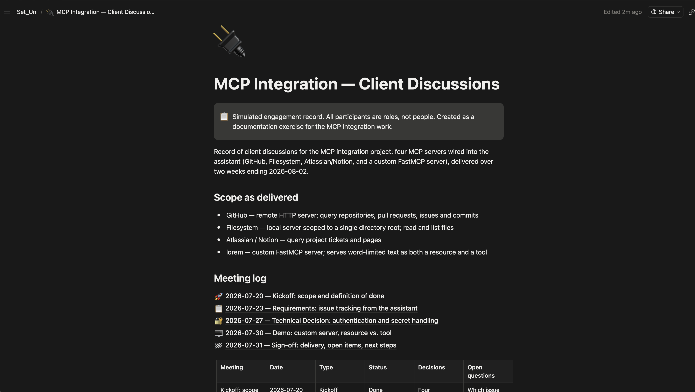

# 🔌 Homework 5: Configure MCP Servers

> **Student Name**: Elena Chiperi
> **Date Submitted**: 02.08.2026
> **AI Tools Used**: Claude Code (Opus 5)

---

## 📋 Overview

Four MCP (Model Context Protocol) servers wired into Claude Code through a single
project-scoped [`.mcp.json`](.mcp.json):

| # | Server | Type | Purpose |
|---|--------|------|---------|
| 1 | **GitHub** | remote HTTP | Query repositories, pull requests, issues, and commits |
| 2 | **Filesystem** | local (`npx`) | Read and list files under this `homework-5/` directory |
| 3 | **Notion** *(+ Atlassian/Jira)* | local (`npx` / `uvx`) | Query project pages and bug tickets |
| 4 | **`lorem`** | local (`uv`) — **custom** | Serve word-limited text from `lorem-ipsum.md` |

The first three are off-the-shelf servers configured with credentials. The fourth is
written from scratch with **FastMCP** and lives in
[`custom-mcp-server/`](custom-mcp-server/).

Setup, credentials, and testing instructions are in **[HOWTORUN.md](HOWTORUN.md)**.

## 🧩 Resources vs. Tools

The two MCP primitives the custom server implements, and how they differ:

- **Resources** are **URIs that Claude can read from** — files, API endpoints, database
  rows. They are *passive*: the client chooses to read them, much like opening a file.
  Identified by a URI such as `lorem://text`; a URI containing a placeholder
  (`lorem://text/{word_count}`) is a **resource template**, letting the client
  parameterise what it reads.
- **Tools** are **actions Claude can call to perform operations** — read a file, run a
  command, create a ticket. They are *active*: the model decides to invoke one, passes
  typed arguments, and gets a result back. A tool may have side effects; a resource
  read generally should not.

This server exposes the same underlying text both ways, which is the point of the
exercise: `lorem://text` is something Claude can *read*, `read` is something Claude can
*do*.

## 🛠️ The custom server

[`custom-mcp-server/server.py`](custom-mcp-server/server.py) — a FastMCP server named
`lorem`, started over **stdio**, that reads
[`custom-mcp-server/lorem-ipsum.md`](custom-mcp-server/lorem-ipsum.md) and returns the
first *N* whitespace-separated words.

| Kind | Name / URI | Parameter | Returns |
|------|------------|-----------|---------|
| Resource | `lorem://text` | — | first **30** words (the default) |
| Resource template | `lorem://text/{word_count}` | `word_count` | first `word_count` words |
| Tool | `read` | `word_count` *(optional, default `30`)* | first `word_count` words |

All three share one `_read_words()` helper, so the resource and the tool can never drift
apart. The source file is resolved relative to `server.py`, so the working directory the
client launches it from does not matter. A `word_count` below `1` is rejected with a
clear error rather than silently returning nothing.

Dependencies are declared in
[`custom-mcp-server/pyproject.toml`](custom-mcp-server/pyproject.toml) (`fastmcp>=2.0.0`,
resolved to **3.4.5**) and pinned in `uv.lock`.

## ✅ Verification

The custom server was checked at two levels:

1. **In-memory FastMCP client** — `lorem://text` returns exactly 30 words,
   `lorem://text/7` exactly 7, `read()` 30, `read(5)` 5, and `read(0)` raises a clean
   `ToolError`. The advertised tool schema is
   `{"word_count": {"type": "integer", "default": 30}}`, so the argument is genuinely
   optional to the model.
2. **Real stdio transport** — the exact command from `.mcp.json`
   (`uv run --directory custom-mcp-server server.py`) starts and completes an MCP
   `initialize` handshake, reporting `serverInfo: {"name": "lorem", "version": "3.4.5"}`.

Reproduce both with the commands in [HOWTORUN.md](HOWTORUN.md#5-test-the-read-tool).

## 📁 Project structure

```
homework-5/
├── README.md                    # this file
├── HOWTORUN.md                  # install, run, connect, test
├── .mcp.json                    # all four servers registered
├── custom-mcp-server/
│   ├── server.py                # FastMCP server: resource + `read` tool
│   ├── lorem-ipsum.md           # source text
│   ├── pyproject.toml           # declares fastmcp
│   └── uv.lock                  # pinned dependency versions
└── docs/
    └── screenshots/             # MCP call results, one per server
```

## 📸 Prompts & results

Every server was exercised from a Claude Code session started in this directory. All
screenshots live in [`docs/screenshots/`](docs/screenshots/).

The section is in two parts. **Part A** is the workflow in the order it actually
happened — each step drove one or more MCP servers to do real work, and both the prompt
and its outcome are captured. **Part B** is the four screenshots the assignment asks
for, one per required server.

---

## Part A — the workflow, step by step

Rather than firing four isolated queries, each server was put to work on a task that
produced something durable: Jira issues, a Confluence tree, pull requests, a Notion
record. The screenshots below are that trail.

### Step 1 — Seed Jira with the project's real history

**Servers:** Atlassian (Jira) · **Screenshots:** 3

The tracker was populated first, so later queries had something authentic to return. The
issues describe the work on *this* homework: one epic, four stories (one per task in
[TASKS.md](TASKS.md)), and six bugs drawn from failures that genuinely occurred during
setup. Bugs were created last and sequentially, so a "last 5 bugs" query returns exactly
those.

**Seeding prompt** — the exact text sent, gated so nothing is created before the project
key and the plan are confirmed:

```text
I have the Atlassian MCP connected. I'm working on homework-5 — configuring
four MCP servers. The assignment is in ./TASKS.md — read it before you start.

Populate Jira with test data reflecting the actual course of work on this
homework.

1. Show me the available Jira projects and wait until I name the key.
   Create nothing before I confirm.
2. Check which issue types and required fields the project has.
3. Draft a plan as a table — type, summary, priority — and wait for my "ok".
4. Then create: 1 Epic for the homework; 4 Story/Task issues, one per task
   from TASKS.md, linked to the epic; 5-6 Bug issues for problems that come
   up during this setup. Create the bugs LAST and sequentially, so a
   "last 5 bugs" query returns exactly those.

Descriptions must state symptom, root cause, and fix. Vary the priorities.
Use labels such as mcp, config, fastmcp, security. No invented people's
names, no real tokens, no real site URLs.

Base the bugs on what genuinely breaks here: a stray trailing character in
the GitHub PAT causes HTTP 400; a .mcp.json in VS Code format (key
"servers" instead of "mcpServers") isn't read by Claude Code;
CONFLUENCE_URL without the /wiki suffix fails to connect; the file holding
secrets never made it into .gitignore; the word_count parameter of the
FastMCP resource arrives as a string and breaks the list slice; the server
can't find lorem-ipsum.md because of a relative path.

Finally, print a table of created issues: key, type, summary.
```

**1.1 — The prompt in the session.**



**1.2 — Reconnaissance and creation plan.** The project's issue types with their IDs,
which fields are required on create, the available priorities, and the note that epic
linking uses `parent` because team-managed projects have no legacy "Epic Link" custom
field — then the 11-row creation plan (type, summary, priority, labels, parent)
presented for approval before anything was written.



**1.3 — The result in Jira.** The List view showing **KAN-4** (epic) with **KAN-5** –
**KAN-8** (stories, one per homework task) and **KAN-9** – **KAN-14** (bugs), each with a
varied priority from Low to Highest.



### Step 2 — Build the documentation tree in Confluence

**Servers:** Atlassian (Confluence) · **Screenshots:** 2

The same server, writing rather than reading. Six pages were generated strictly from the
files in this directory — no invented features — with all credentials reduced to
`${VAR}` names.

**2.1 — The prompt as sent.** Read `TASKS.md`, `README.md`, `HOWTORUN.md`, `.mcp.json`,
`server.py` and `pyproject.toml` first; list accessible spaces and wait for confirmation;
propose the page tree; then create pages one at a time. Variable **names** only — no
values, tokens or emails.



**2.2 — The finished tree.** Six pages under **Homework 5 — MCP Server Configuration**:
*1. Architecture & Configuration*, *2. Credentials & Security*, *3. Custom FastMCP
Server*, *4. Runbook*, *5. Troubleshooting*, *6. Verification Log* — with the
Troubleshooting page open, showing its symptom / root cause / fix table cross-linked to
the Jira bug keys (the HTTP 400 row links to KAN-9).



### Step 3 — Fix the bugs and open pull requests

**Servers:** Atlassian (Jira) + GitHub · **Screenshots:** 2

The two servers used together in one workflow: read the six bugs from Jira, make a small
genuine fix for each, open one pull request per bug through the GitHub API, then move
each issue to the review column. No local git commands and no branch switching in the
working tree.

**3.1 — The prompt as sent.** All git work through the GitHub MCP, one bug per branch
named `fix/<JIRA-KEY>-<slug>`, confirmation gates before the bug list, the target
repository and the plan table, and a rule that every change must correspond to a real
file — never a fabricated diff.



**3.2 — Six pull requests, one per bug.** The repository's PR list showing **6 Open**
alongside the 3 closed homework PRs — `#9` KAN-14, `#8` KAN-13, `#7` KAN-12, `#6`
KAN-11, `#5` KAN-10, `#4` KAN-9 — all created through the API and left unmerged for
review.



Because most of the bugs were already fixed in the code, each change is the thing that
stops the failure recurring: a `.gitignore` rule, an `int()` guard, a regression test, or
a Troubleshooting row. One turned out to be a live gap — `.claude/.env.json` was not
covered by any ignore rule (KAN-12).

### Step 4 — Record simulated client discussions in Notion

**Servers:** Notion · **Screenshots:** 2

The fourth server, writing a client-facing engagement record: a parent page, a meetings
table, and five meeting pages with dialogue, decision callouts and action-item
checkboxes. Participants are roles — Client, Tech Lead, Developer — not people.

**4.1 — The prompt as sent.** Ground every technical detail in `TASKS.md`, `README.md`
and `.mcp.json`; confirm the parent page before creating anything; roles not names;
proper Notion blocks; and at least one disagreement that gets resolved.



**4.2 — The created record.** **MCP Integration — Client Discussions**, showing the
simulation callout, the four servers under *Scope as delivered*, and the meeting log
linking the five sessions from Kickoff (2026-07-20) through Sign-off (2026-07-31), above
the meetings table.



---

## Part B — required deliverables, one per server

The four screenshots named in the assignment. Each is a single self-contained
interaction: the prompt as sent, and the response as returned.

### 1. GitHub MCP

```text
List the 5 most recent pull requests in my gen-ai-software-engineering
repository and summarise in one line what each one changed.
```

**Result**: returned the five most recent PRs — `#9` KAN-14, `#8` KAN-13, `#7` KAN-12,
`#6` KAN-11, `#5` KAN-10 — each with a one-line summary of what it changed, noting that
all five are open and target `feature/homework-5`.


### 2. Filesystem MCP

```text
Using the filesystem MCP server, list the contents of homework-5 and
read custom-mcp-server/pyproject.toml. Tell me which dependencies are
declared there.
```

**Result**: three filesystem calls — `list_allowed_directories`, `list_directory`,
`read_text_file` — with no built-in file tools used. Reported the allowed root, listed
the nine entries in `homework-5/`, and read the manifest: exactly one declared
dependency, **`fastmcp>=2.0.0`**, with `requires-python = ">=3.10"` and
`package = false`.

The reported root is `…/gen-ai-software-engineering/homework-5`, narrower than the
`${HOME}/Projects/set_uni_ai` argument in [`.mcp.json`](.mcp.json): the MCP client
supplies the project directory as the server's root, and the server honours that over
its own argument. The narrowing was verified, not assumed — requesting the parent
directory returns `Access denied - path outside allowed directories`. The practical
effect is a tighter sandbox than configured, which is the safe direction to be wrong in.


### 3. Jira MCP

The project was first seeded with issues describing the work on this very homework
(**Step 1** above), so the query below has something realistic to return. The seeding
prompt is reproduced there.

The verification query required by the assignment:

```text
Give me the tickets of the last 5 bugs on a project
```

**Result**: returned five bug keys, newest first — **KAN-14**, **KAN-13**, **KAN-12**,
**KAN-11**, **KAN-10** — with type and status only. Summaries, descriptions, reporters
and assignees are deliberately omitted, per the assignment's instruction to represent
the response with ticket numbers alone.

All five read *In Review* rather than *To Do* because the pull-request workflow in
**Step 3** moved each bug to the review column as its fix was opened. KAN-9 is absent by
design: the project holds six bugs, and "last 5" by creation date excludes the oldest.


### 4. Custom `lorem` MCP

```text
Using the lorem MCP server, call the read tool with word_count 12.
Then read the resource lorem://text and confirm how many words it
returned by default.
```

**Result**: both primitives exercised in one interaction. The `read` **tool** with
`word_count: 12` returned exactly 12 words; the **resource** `lorem://text`, called with
no parameter, returned exactly 30 — the documented default. The resource output begins
with the same 12 words the tool returned and continues through to `exercitation`, which
confirms both routes share the single `_read_words()` helper rather than duplicating
logic.

| Call | Requested | Returned |
|---|---|---|
| `read(word_count=12)` | 12 | 12 ✅ |
| `lorem://text` | *(unspecified)* | 30 ✅ |


## 🔐 A note on credentials

`.mcp.json` contains **no secrets** — every credential is a `${VAR}` reference resolved
from the environment at launch. See
[HOWTORUN.md § Credentials](HOWTORUN.md#2-provide-credentials) for the variables to set.
