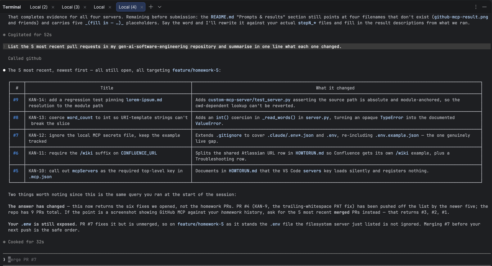
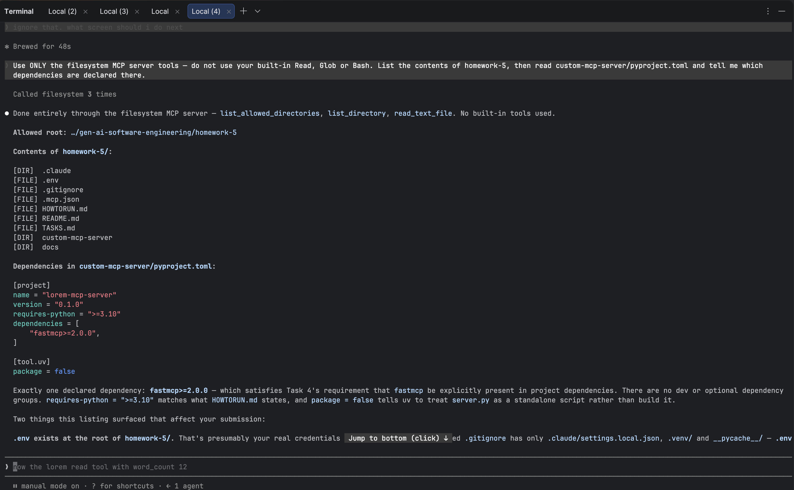
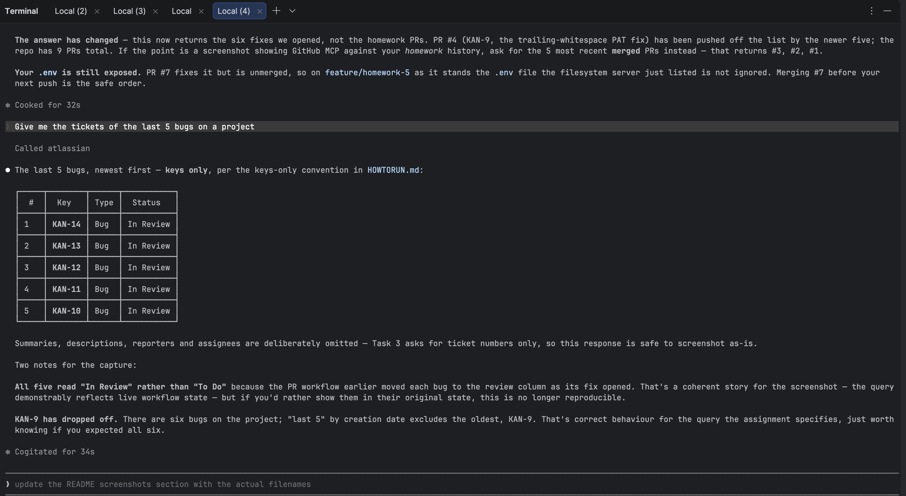
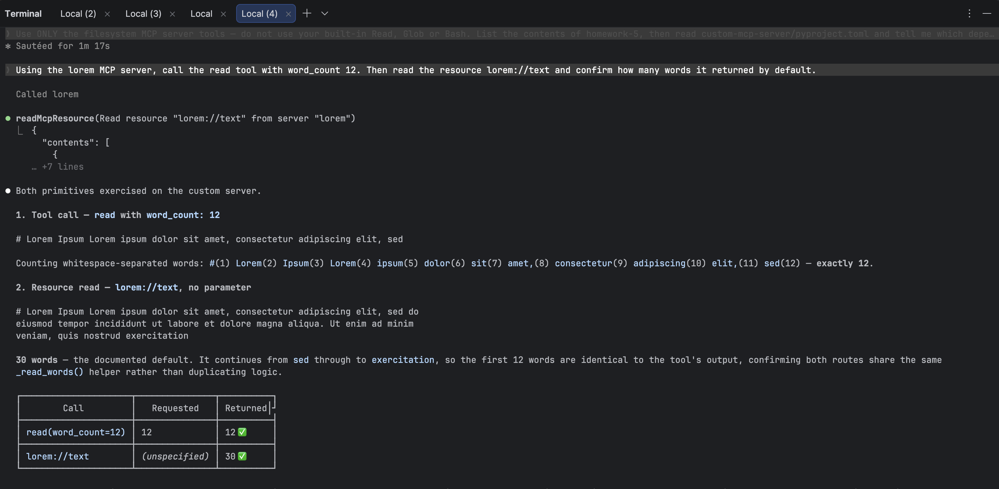

# 🔌 Homework 5: Configure MCP Servers

> **Student Name**: Elena Chiperi
> **Date Submitted**: 02.08.2026
> **AI Tools Used**: Claude Code (Opus 5)

---

## 📋 Overview

Four MCP (Model Context Protocol) servers wired into Claude Code through a single
project-scoped [`.mcp.json`](.mcp.json):

| # | Server | Type | Purpose |
|---|--------|------|---------|
| 1 | **GitHub** | remote HTTP | Query repositories, pull requests, issues, and commits |
| 2 | **Filesystem** | local (`npx`) | Read and list files under `~/Projects/set_uni_ai` |
| 3 | **Notion** *(+ Atlassian/Jira)* | local (`npx` / `uvx`) | Query project pages and bug tickets |
| 4 | **`lorem`** | local (`uv`) — **custom** | Serve word-limited text from `lorem-ipsum.md` |

The first three are off-the-shelf servers configured with credentials. The fourth is
written from scratch with **FastMCP** and lives in
[`custom-mcp-server/`](custom-mcp-server/).

Setup, credentials, and testing instructions are in **[HOWTORUN.md](HOWTORUN.md)**.

## 🧩 Resources vs. Tools

The two MCP primitives the custom server implements, and how they differ:

- **Resources** are **URIs that Claude can read from** — files, API endpoints, database
  rows. They are *passive*: the client chooses to read them, much like opening a file.
  Identified by a URI such as `lorem://text`; a URI containing a placeholder
  (`lorem://text/{word_count}`) is a **resource template**, letting the client
  parameterise what it reads.
- **Tools** are **actions Claude can call to perform operations** — read a file, run a
  command, create a ticket. They are *active*: the model decides to invoke one, passes
  typed arguments, and gets a result back. A tool may have side effects; a resource
  read generally should not.

This server exposes the same underlying text both ways, which is the point of the
exercise: `lorem://text` is something Claude can *read*, `read` is something Claude can
*do*.

## 🛠️ The custom server

[`custom-mcp-server/server.py`](custom-mcp-server/server.py) — a FastMCP server named
`lorem`, started over **stdio**, that reads
[`custom-mcp-server/lorem-ipsum.md`](custom-mcp-server/lorem-ipsum.md) and returns the
first *N* whitespace-separated words.

| Kind | Name / URI | Parameter | Returns |
|------|------------|-----------|---------|
| Resource | `lorem://text` | — | first **30** words (the default) |
| Resource template | `lorem://text/{word_count}` | `word_count` | first `word_count` words |
| Tool | `read` | `word_count` *(optional, default `30`)* | first `word_count` words |

All three share one `_read_words()` helper, so the resource and the tool can never drift
apart. The source file is resolved relative to `server.py`, so the working directory the
client launches it from does not matter. A `word_count` below `1` is rejected with a
clear error rather than silently returning nothing.

Dependencies are declared in
[`custom-mcp-server/pyproject.toml`](custom-mcp-server/pyproject.toml) (`fastmcp>=2.0.0`,
resolved to **3.4.5**) and pinned in `uv.lock`.

## ✅ Verification

The custom server was checked at two levels:

1. **In-memory FastMCP client** — `lorem://text` returns exactly 30 words,
   `lorem://text/7` exactly 7, `read()` 30, `read(5)` 5, and `read(0)` raises a clean
   `ToolError`. The advertised tool schema is
   `{"word_count": {"type": "integer", "default": 30}}`, so the argument is genuinely
   optional to the model.
2. **Real stdio transport** — the exact command from `.mcp.json`
   (`uv run --directory custom-mcp-server server.py`) starts and completes an MCP
   `initialize` handshake, reporting `serverInfo: {"name": "lorem", "version": "3.4.5"}`.

Reproduce both with the commands in [HOWTORUN.md](HOWTORUN.md#5-test-the-read-tool).

## 📁 Project structure

```
homework-5/
├── README.md                    # this file
├── HOWTORUN.md                  # install, run, connect, test
├── .mcp.json                    # all four servers registered
├── custom-mcp-server/
│   ├── server.py                # FastMCP server: resource + `read` tool
│   ├── lorem-ipsum.md           # source text
│   ├── pyproject.toml           # declares fastmcp
│   └── uv.lock                  # pinned dependency versions
└── docs/
    └── screenshots/             # MCP call results, one per server
```

## 📸 Prompts & results

Every server was exercised from a Claude Code session started in this directory. The
prompt below each heading is the exact text sent; the screenshot is the captured
response. All screenshots live in [`docs/screenshots/`](docs/screenshots/).

### 1. GitHub MCP

```text
List the 5 most recent pull requests in my gen-ai-software-engineering
repository and summarise in one line what each one changed.
```

**Result**: _(fill in — e.g. "returned 5 PRs with numbers, titles, and authors")_



### 2. Filesystem MCP

```text
Using the filesystem MCP server, list the contents of homework-5 and
read custom-mcp-server/pyproject.toml. Tell me which dependencies are
declared there.
```

**Result**: _(fill in — e.g. "listed the tree and reported `fastmcp>=2.0.0`")_



### 3. Jira MCP

The project was first seeded with issues describing the work on this very homework, so
the query below has something realistic to return. Seeding prompt:

```text
I have the Atlassian MCP connected. I'm working on homework-5 — configuring
four MCP servers. The assignment is in ./TASKS.md — read it before you start.

Populate Jira with test data reflecting the actual course of work on this
homework.

1. Show me the available Jira projects and wait until I name the key.
   Create nothing before I confirm.
2. Check which issue types and required fields the project has.
3. Draft a plan as a table — type, summary, priority — and wait for my "ok".
4. Then create: 1 Epic for the homework; 4 Story/Task issues, one per task
   from TASKS.md, linked to the epic; 5-6 Bug issues for problems that come
   up during this setup. Create the bugs LAST and sequentially, so a
   "last 5 bugs" query returns exactly those.

Descriptions must state symptom, root cause, and fix. Vary the priorities.
Use labels such as mcp, config, fastmcp, security. No invented people's
names, no real tokens, no real site URLs.

Base the bugs on what genuinely breaks here: a stray trailing character in
the GitHub PAT causes HTTP 400; a .mcp.json in VS Code format (key
"servers" instead of "mcpServers") isn't read by Claude Code;
CONFLUENCE_URL without the /wiki suffix fails to connect; the file holding
secrets never made it into .gitignore; the word_count parameter of the
FastMCP resource arrives as a string and breaks the list slice; the server
can't find lorem-ipsum.md because of a relative path.

Finally, print a table of created issues: key, type, summary.
```

The verification query required by the assignment:

```text
Give me the tickets of the last 5 bugs on a project
```

**Result**: _(fill in — list the 5 issue keys only, no summaries or assignees)_



### 4. Custom `lorem` MCP

```text
Using the lorem MCP server, call the read tool with word_count 12.
Then read the resource lorem://text and confirm how many words it
returned by default.
```

**Result**: _(fill in — e.g. "12 words from the tool, 30 from the resource")_



## 🔐 A note on credentials

`.mcp.json` contains **no secrets** — every credential is a `${VAR}` reference resolved
from the environment at launch. See
[HOWTORUN.md § Credentials](HOWTORUN.md#2-provide-credentials) for the variables to set.
